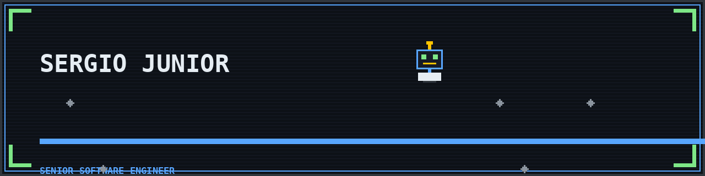

<div align="center">

<picture>
  <source media="(prefers-color-scheme: dark)" srcset="assets/readme/banner-dark.png">
  <source media="(prefers-color-scheme: light)" srcset="assets/readme/banner-light.png">
  
</picture>

**Senior Software Engineer** · Backend & Plataforma · em direção a **Arquitetura de Software**

📍 Igarassu · Grande Recife · PE, Brasil

[GitHub](https://github.com/sergingroisman) · [LinkedIn](https://www.linkedin.com/in/giorgiosaints) · [Site](https://sergingroisman.github.io) · [sergingroisman@gmail.com](mailto:sergingroisman@gmail.com)

</div>

```ts
// sergio-junior.ts
const sergio = {
  role:      "Senior Software Engineer",
  location:  "Igarassu · Grande Recife · PE, Brasil",
  direction: "Backend/Plataforma → Arquitetura de Software",
  focus:     ["Arquitetura", "APIs", "Cloud & DevOps", "IAM & Secure Dev", "IA aplicada"],
  building:  ["teishoku (SaaS de delivery com geolocalização)", "CLIs & automações", "laboratório de infra"],
} as const;
```

Engenheiro de software sênior com **6+ anos** construindo backends, APIs e plataformas. Foco em **arquitetura**, desenho de APIs, cloud/DevOps e segurança de aplicações — hoje evoluindo explicitamente para **arquitetura de software**.

---

## 01 · Current Quest

- 🧭 **Trilha de Arquitetura** — desenho de sistemas, limites entre domínios e decisões técnicas explícitas.
- 🔐 **Secure Development** — Keycloak, IAM, RBAC/ABAC/ACL e identidade como parte do design.
- 🤖 **IA aplicada & Agentes** — orquestração de LLMs, agentes e desenvolvimento assistido por IA.
- ⌨️ **CLIs & Automação** — ferramentas próprias (Rust e Node) para eliminar trabalho manual.
- 🎮 **Estudo de Rust e Odin** — aprendendo as duas para construir um jogo.
- 🧪 **Laboratório de Infraestrutura** — homelab, VPS, deploy e experimentação contínua.

## 02 · Engineering Profile

| Área | O que faço |
|---|---|
| **Arquitetura** | Desenho de sistemas, separação de domínio, arquitetura hexagonal, contratos de API |
| **Backend & APIs** | TypeScript/Node, NestJS, serviços REST, integrações |
| **Cloud, DevOps & Automação** | Docker, VPS, Kubernetes, Terraform, pipelines |
| **IA aplicada & Agentes** | Orquestração de LLMs, agentes, integrações (GitHub/Jira/Slack/IA) |
| **Identity & Segurança** | Keycloak, IAM, RBAC/ABAC/ACL, secure development |
| **Developer Tooling** | CLIs, automações, documentação técnica e transferência de conhecimento |

## 03 · Selected Work

| Projeto | Problema | Contribuição / decisão técnica | Stack | Evidência | Status |
|---|---|---|---|---|---|
| [`teishoku`](https://github.com/sergingroisman/teishoku) | Delivery de comida de bairro carece de ferramenta sob medida | Monorepo próprio (API + web) com **geolocalização como diferencial** para acompanhar entregas; modelagem de domínio de pedidos e catálogo. | TypeScript · NestJS · Next.js · Prisma · PostgreSQL | [repo](https://github.com/sergingroisman/teishoku) | início ativo |
| [`sergingroisman.github.io`](https://github.com/sergingroisman/sergingroisman.github.io) | Precisava de vitrine própria para escrever e publicar | Blog/portfólio mantido do zero. | Hexo · Butterfly | [site](https://sergingroisman.github.io) | publicado |

> Os repositórios de ferramentas de IA/CLI que aparecem no meu perfil são **forks de terceiros** e não entram aqui como trabalho próprio.

## 04 · Contributions

| Contribution | Scope | Evidence |
|---|---|---|
| — | Contribuições públicas em repositórios de terceiros ainda não registradas | — |

> Estado honesto: ainda não há PRs/issues/releases públicos de minha autoria em projetos de terceiros. Esta seção será atualizada com evidências reais — sem métricas inventadas.

## 05 · Toolbox

<details>
<summary><b>Languages</b></summary>

TypeScript · JavaScript · Rust (estudando) · Odin (estudando)

</details>

<details>
<summary><b>Backend</b></summary>

NestJS · Node.js · APIs REST · Prisma

</details>

<details>
<summary><b>Frontend</b></summary>

Next.js · React

</details>

<details>
<summary><b>Infrastructure</b></summary>

Docker · VPS · Kubernetes · Terraform

</details>

<details>
<summary><b>Security & IAM</b></summary>

Keycloak · IAM · RBAC / ABAC / ACL · Secure Development

</details>

<details>
<summary><b>AI & Automation</b></summary>

Orquestração de LLMs · Agentes · Integrações (GitHub · Jira · Slack · IA)

</details>

<details>
<summary><b>Tooling</b></summary>

CLIs · Automação · Documentação técnica · Developer productivity

</details>

## 06 · Knowledge Base

Base de conhecimento em construção no [blog pessoal](https://sergingroisman.github.io) — primeiro artigo publicado.

## 07 · Beyond Code

Games de **estratégia, corrida, FPS e indies** (Nintendo Switch & PC) · **anime, mangá, filmes e séries** · **projetos e customização de carros** · **home office, hardware e experimentação técnica**.

## 08 · Contact

- **GitHub** — [github.com/sergingroisman](https://github.com/sergingroisman)
- **LinkedIn** — [linkedin.com/in/giorgiosaints](https://www.linkedin.com/in/giorgiosaints)
- **Site** — [sergingroisman.github.io](https://sergingroisman.github.io)
- **E-mail** — [sergingroisman@gmail.com](mailto:sergingroisman@gmail.com)

---

<div align="center">
<sub>Banner e divisores em pixel art própria · sem contadores de views, sem barras de %, sem estatísticas sem contexto.</sub>
</div>
